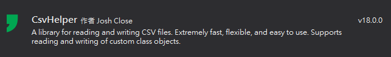
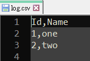
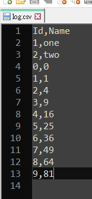
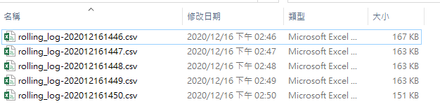

# csvLogger.cs

## Install

### Dependencies 

https://www.nuget.org/packages/CsvHelper/




## Example

write data line

```c#
csvLogger clog = new csvLogger(@".\logs\log.csv");
```


```c#
dynamic record = new ExpandoObject();

record.Id = 1;
record.Name = "one";
clog.WriteRecord(record);

record.Id = 2;
record.Name = "two";
clog.WriteRecord(record);

```



```c#
List<dynamic> records = new List<dynamic>();
for (int id = 0; id < 10; id++)
{
    dynamic record = new ExpandoObject();
    record.Id = id;
    record.Name = id * id;
    records.Add(record);
}

clog.WriteRecords(records);
```




---

```c#
csvLogger rolling_log = new csvLogger(
    @".\logs\rolling_log.csv",
    i_rollingInterval: csv_logger.RollingInterval.Minute,
    i_retainedFileCountLimit: 5);
```

```c#
private void timer1_Tick(object sender, EventArgs e)
{
    Random rand = new Random();    
    dynamic record = new ExpandoObject();
    
    record.time = System.DateTime.Now.ToString("yyyy-MM-dd HH:mm:ss.fff");
    record.rand = rand.NextDouble();

    this.rolling_log.WriteRecord(record);
}
```




# _ (┐「ε:) _

